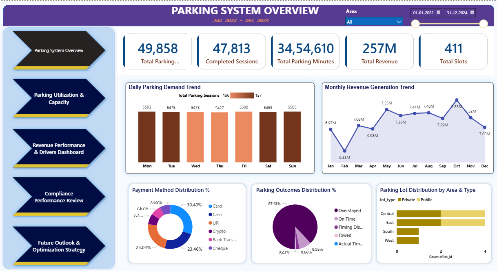
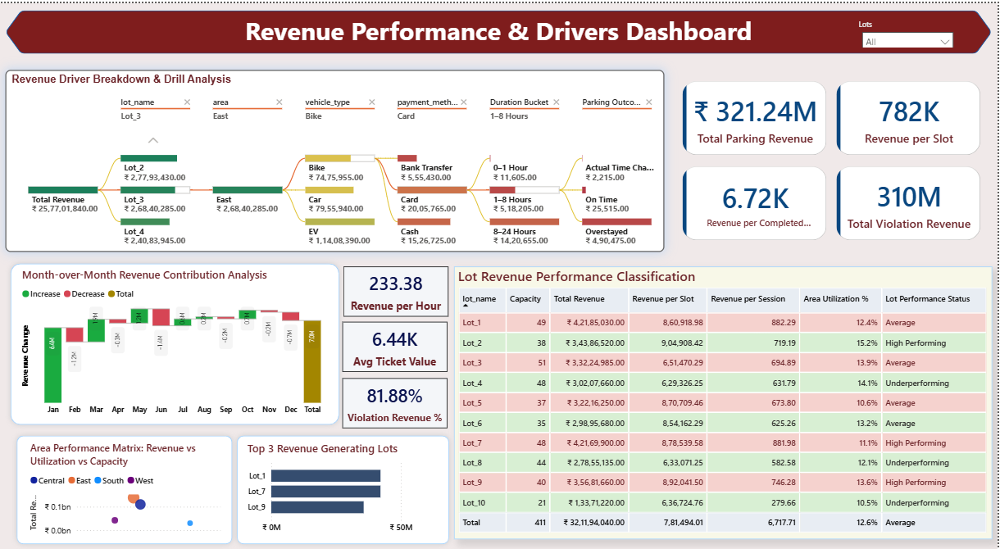
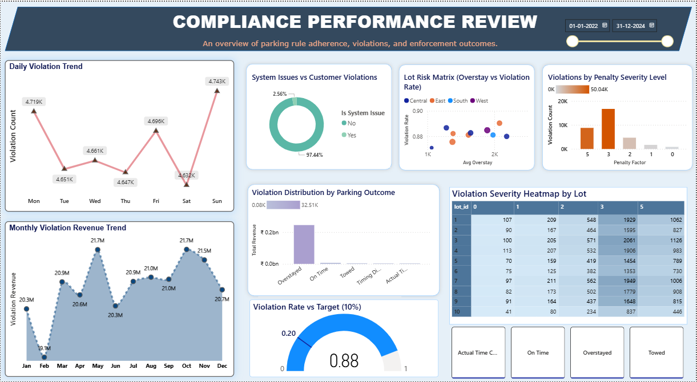

# Parking Management Analytics

## Project Overview
This project analyzes parking system data to understand demand patterns, revenue generation, and compliance behavior.  
The objective is to identify key revenue drivers, evaluate operational efficiency, and provide data-driven recommendations for optimization.

The analysis is performed primarily using Power BI, supported by SQL-based KPI validation and metric structuring.

---

## Business Objectives
- Analyze parking demand trends across time (daily, hourly, monthly)
- Identify key revenue drivers and high-performing parking lots
- Evaluate utilization and capacity efficiency
- Monitor compliance and violation patterns
- Forecast revenue and simulate pricing strategies for optimization

---

## Tools & Technologies
**Power BI**
- Data cleaning using Power Query  
- Data modeling (relationships and schema design)  
- DAX for KPI creation and time intelligence  
- Interactive dashboard development  

**SQL**
- KPI query development (revenue, sessions, utilization)  
- Data validation and cross-checking with Power BI outputs  
- Aggregations and filtering for business metrics  

---

## Data Model Overview
The dataset simulates real-world parking operations and includes:

- Events Table – entry time, exit time, parking duration, session activity  
- Payments Table – transaction details, payment methods, revenue  
- Lots & Slots Tables – parking capacity and distribution  
- Violations Table – overstays, penalties, and compliance data  

A structured data model was built in Power BI to enable efficient analysis and KPI tracking.

---

## Dashboard Breakdown

### Parking System Overview & KPI Summary


Provides a high-level snapshot of total sessions, revenue, parking minutes, and system capacity.

---

### Parking Utilization & Capacity Analysis


Highlights occupancy trends, peak congestion hours, and utilization efficiency across parking lots.

---

### Revenue Performance & Key Drivers Analysis


Breaks down revenue by vehicle type, payment method, duration, and parking outcomes.

---

### Compliance & Violation Performance Analysis


Analyzes violation trends, penalty distribution, and risk areas across parking zones.

---

### Future Outlook & Revenue Optimization Strategy


Simulates pricing scenarios and forecasts revenue growth under different strategies.

---

## Key Insights
- Violations contribute a significant share of total revenue and act as a major revenue driver  
- Peak parking demand occurs during specific hours and weekdays  
- Certain parking lots consistently outperform others, while some remain underutilized  
- Revenue is strongly influenced by parking duration and violation penalties  
- Pricing adjustments can significantly impact revenue, with associated operational risks  

---

## Key KPIs Tracked
- Total Parking Sessions  
- Completed Sessions  
- Total Parking Minutes  
- Total Revenue  
- Revenue per Slot  
- Revenue per Session  
- Violation Revenue Percentage  
- Utilization Rate  
- Average Parking Duration  

---

## Sample SQL KPIs (Conceptual)

```sql
-- Total Revenue
SELECT SUM(amount) AS total_revenue
FROM payments
WHERE payment_status = 'completed';

-- Total Parking Sessions
SELECT COUNT(event_id) AS total_sessions
FROM events;

-- Violation Revenue Contribution
SELECT 
    SUM(CASE WHEN violation_flag = 'Y' THEN amount ELSE 0 END) * 100.0 
    / SUM(amount) AS violation_revenue_pct
FROM payments;

-- Average Parking Duration
SELECT AVG(parking_minutes_clean) AS avg_duration
FROM events;
