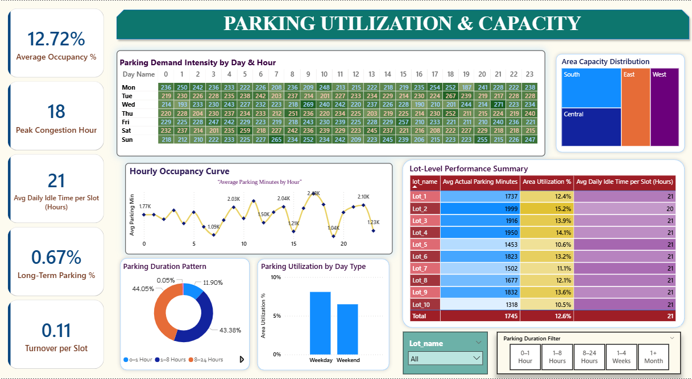
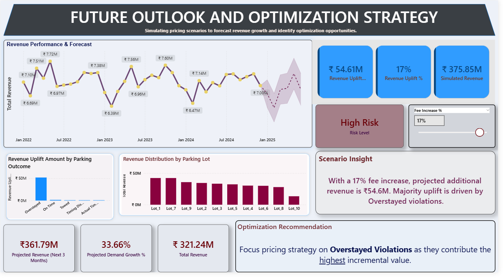

# Parking Management Analytics Project

## 📌 Project Overview
This project focuses on analyzing parking system data to understand demand patterns, revenue generation, and compliance behavior.  
The objective was to identify key revenue drivers, evaluate operational efficiency, and provide actionable insights for optimization.

---

## 🛠️ Tools & Technologies
- **Power BI** – Data cleaning (Power Query), data modeling, DAX measures, and interactive dashboard development  
- **SQL** – KPI query development and data validation

---

## 📊 Dashboard Sections

### 🔹 Parking System Overview & KPI Summary

### 🔹 Parking Utilization & Capacity Analysis

### 🔹 Revenue Performance & Key Drivers Analysis

### 🔹 Compliance & Violation Performance Analysis

### 🔹 Future Outlook & Revenue Optimization Strategy

---

## 🔍 Key Insights
- 🚨 **Violations emerged as the primary revenue driver**, contributing significantly to total earnings  
- 📈 Peak parking demand is concentrated during specific hours and weekdays  
- 🅿️ Certain parking lots consistently outperform others, while some remain underutilized  
- 💰 Revenue shows a strong correlation with demand intensity and parking duration  
- 🔮 Scenario analysis indicates that **pricing adjustments can significantly increase revenue**, though with associated risk levels  

---

## 📁 Project Files
- 📊 Power BI Dashboard (`.pbix`)  
- 🧾 SQL Queries (`.sql`)  
- 📑 Project Presentation (`.pptx`)  
- 🖼️ Dashboard Screenshots  

---

## 📌 Dataset
A **synthetic dataset (~50,000 records)** was created to simulate real-world parking operations, including events, payments, and violations.

---

## 🎯 Conclusion
This project demonstrates how data analytics can be used to:
- Improve operational efficiency  
- Identify revenue opportunities  
- Support data-driven decision making in parking management systems  

---

⭐ *If you found this project useful, feel free to explore and connect!*
